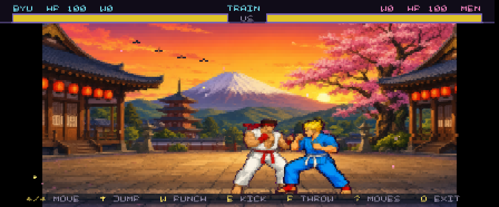
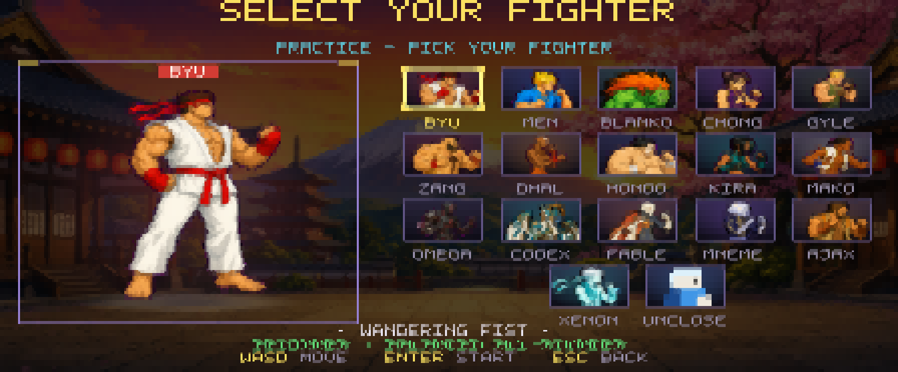
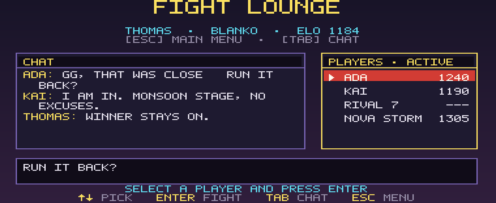

<div align="center">

# SSH Street Fighter

### A real-time arcade fighter streamed through your terminal.

[](https://github.com/thomasdavis/ssh-street-fighter/actions/workflows/ci.yml)
[](LICENSE)
[](tsconfig.json)
[](#play-now)

No download. No browser. No account. Just SSH in, choose a fighter, and throw hands.

```console
ssh -p 2223 streetfighter.blah.dev
```

[Play now](#play-now) · [Browse fighter guides & sprites](https://streetfighter.blah.dev) · [How it works](docs/ARCHITECTURE.md) · [Contribute](CONTRIBUTING.md)



</div>

## Why this is fun

SSH Street Fighter is a full two-player fighting game rendered with 24-bit ANSI color and Unicode half-block pixels. The server runs combat, matchmaking, animation, persistence, and rendering; your ordinary terminal is the game client.

- **Twelve complete fighters**, each with three character-specific special moves
- **Six animated arenas** with rain, surf, mist, steam, petals, runway lights, and other stage-bound motifs
- **Real motion inputs** with a packet-safe input buffer for split SSH escape sequences
- **Best-of-three online fights**, solo practice, direct challenges, and a quick-match queue
- **Persistent ELO ratings**, records, leaderboard, handles, and lounge chat
- **Per-player controls**, configurable in-game and remembered with your SSH identity
- **Zoom-proof adaptive HUD** using crisp terminal glyphs over the renderer-native world
- **Truecolor by default**, compressed and diff-streamed without flattening the palette
- **Live fighter dossiers** with original stories, animated sprites, tactics, inputs, damage, and frame data

<table>
  <tr>
    <td width="50%"></td>
    <td width="50%"></td>
  </tr>
  <tr>
    <td align="center"><strong>Eleven distinct move sets</strong></td>
    <td align="center"><strong>Chat, presence, and direct challenges</strong></td>
  </tr>
</table>

## Play now

Any terminal with SSH and truecolor support works:

```console
ssh -p 2223 streetfighter.blah.dev
```

Your public-key fingerprint becomes your identity. Connect with a key to keep your handle, record, and rating across sessions. Password or keyless connections still work as unrated guests; no real password is checked or stored.

> New to SSH? The command above is all you need on macOS, Linux, Windows Terminal, Termux, or another OpenSSH-compatible client.

## Controls

| Action | Key |
|---|---|
| Walk / crouch / jump | Arrow keys |
| Punch | `W` |
| Kick | `E` |
| Jump (alternate) | Space |
| Block | Hold away from your opponent |
| Character move card | `?` during a fight |
| Leave a match | `Q` |
| Menus | `W` / `S`, arrows, Enter |

Choose **Controls** on the main menu to rebind every combat direction, both jump slots, punch, and kick. Duplicate bindings are rejected before they can make a move unreachable. Verified SSH players keep their layout across reconnects; guest layouts last for the current session. `Q`, `V`, and `?` remain fixed so leaving a fight, changing graphics mode, and opening the move card are always recoverable.

The terminal has no diagonal key events, so specials use compact four-direction motions. Inputs are relative to the direction your fighter is facing.

<details>
<summary><strong>All 36 special moves</strong></summary>

| Fighter | Special moves |
|---|---|
| **BYU** | `→ ↓ → + W` Dragon Punch · `↓ → + W` Hadouken · `↓ ← + E` Hurricane Kick |
| **MEN** | `→ ↓ → + W` Blazing Uppercut · `↓ → + W` Fireball · `↓ ← + E` Tornado Kick |
| **BLANKO** | `← → + W` Rolling Attack · `↓ ↑ + E` Vertical Roll · `↓ ↑ + W` Electric Thunder |
| **CHONG** | `↓ → + W` Kikoken · `↓ → + E` Lightning Legs · `↓ ↑ + E` Spinning Bird Kick |
| **GYLE** | `← → + W` Sonic Boom · `↓ ↑ + E` Flash Kick · `↓ ← + W` Sonic Cyclone |
| **ZANG** | `→ ↓ ← + W` Cyclone Driver · `← → + W` Double Lariat · `↓ ← + E` Flying Press |
| **DHAL** | `↓ → + W` Yoga Fire · `↓ ← + W` Yoga Flame · `↓ → + E` Drill Kick |
| **HONDO** | `← → + W` Sumo Headbutt · `↓ → + W` Hundred Hand · `↓ ↑ + E` Sumo Smash |
| **KIRA** | `→ ↓ → + W` Zero Ascent · `↓ → + W` Phase Needle · `↓ ← + E` Rift Counter |
| **MAKO** | `↓ → + W` Moon Tide · `↓ → + E` Ginga Rush · `↓ ← + E` Axé Wheel |
| **OMEGA** | `↓ → + W` Final Testimony · `← → + E` Null Step · `↓ ← + W` Entropy Well |
| **CODEX** | `↓ ↑ + W` Context Ascent · `← → + E` Branchwalk · `↓ → + E` Merge Comet |

</details>

## The arenas

Dojo · Night Market · Jungle Ruins · Mountain Airbase · Monsoon Palace · Storm Harbor

Each arena is a packed 240×160 RGBA scene with its own bounded procedural motif layer. The motifs animate independently at 7.5 Hz, while combat and input remain at 30 Hz.

## Run your own server

Requirements: Node.js 22+, pnpm 9+, and `ssh-keygen`.

```bash
git clone https://github.com/thomasdavis/ssh-street-fighter.git
cd ssh-street-fighter
pnpm install --frozen-lockfile
pnpm run keygen
pnpm start
```

The server listens on `0.0.0.0:2223` by default. Configuration is entirely environment-based:

| Variable | Default | Purpose |
|---|---:|---|
| `SF_HOST` | `0.0.0.0` | SSH bind address |
| `SF_PORT` | `2223` | SSH port |
| `SF_DB` | `data/streetfighter.db` | SQLite database path |
| `SF_COLOR_STEP` | `1` | Explicit RGB quantization step; `1` is full truecolor |
| `SF_COLOR_MODE` | unset | Set to `256` only for an intentionally indexed-color server |
| `SF_DISCORD_WEBHOOK` | unset | Optional best-effort Discord destination for vital community events only |

All events are recorded locally in the append-only `analytics_events` SQLite table for the planned analytics site. Discord receives only quick-match waiting, match start/result, forfeit, and lounge chat events. Inputs, special moves, screen views, connections, and terminal resolution changes never go to Discord. See [the analytics contract](docs/ANALYTICS.md).

Copy [`.env.example`](.env.example) as a starting point. Never commit a webhook, host key, database, or gallery admin token.

### Fighter dossiers and sprite gallery

The optional Next.js site renders every packed pose as a PNG and publishes one responsive guide at `/fighters/<name>` for every roster entry. Profiles include original background stories, animated move sequences, tactics, inputs, damage, chip, range, and frame timing. A prebuild exporter reads the real roster, move, and engine modules before every web build, so the site cannot drift into a second hand-maintained combat database.

```bash
cd web
pnpm install --frozen-lockfile
pnpm build
pnpm start
```

It runs on port `3130`. Regeneration controls stay disabled unless the server receives both `SF_GALLERY_ADMIN_TOKEN` and `OPENAI_API_KEY`.

## Performance model

The renderer preserves color and detail while limiting transport work:

- simulation and input at **30 Hz**; rendering at **15 Hz**, adaptively lower only for exceptionally large terminals
- changed-cell ANSI diffs instead of full-frame redraws
- SSH zlib compression, slow-client backpressure, and obsolete-frame coalescing
- bounded sprite and stage caches
- a `300×120` terminal safety cap
- native truecolor (`38;2` / `48;2`) unless the operator explicitly opts into indexed mode

See [the architecture guide](docs/ARCHITECTURE.md) for the render and session pipelines.

## Development

```bash
pnpm typecheck
pnpm test                 # combat, assets, persistence, ANSI reconstruction
pnpm test:e2e             # lounge, challenge, matchmaking, and practice over real SSH
pnpm exec tsx src/dump-png.ts fight 112 36
```

The asset contract verifies all twelve complete dossiers, all 36 explained special-move definitions, every required fighter pose, and all six stage payloads. CI also rebuilds the authoritative fighter catalog and the Next.js site.

## Project map

```text
src/
  game/       deterministic 30 Hz combat, moves, roster, stages, sprites
  render/     RGB pixel grids, terminal-cell conversion, exact ANSI diffs
  screens/    menu, select, lounge, fight HUD, help, results, leaderboard
  net/        SSH authentication, sessions, matchmaking, challenges
  db/         additive SQLite schema, players, controls, ELO, match/chat/event history
  telemetry/  local analytics plus vital-only non-blocking Discord delivery
assets/
  sprites/    packed RGBA pose JSON files plus one generation anchor per fighter
  stages/     six packed arena backgrounds
web/          Next.js fighter dossiers, animated sprite gallery, and guarded regeneration UI
```

## Contributing

Bug fixes, renderer work, accessibility improvements, terminal compatibility reports, fighter balance, sprites, and new arenas are welcome. Start with [CONTRIBUTING.md](CONTRIBUTING.md), and please follow the [community guidelines](CODE_OF_CONDUCT.md).

The public [roadmap](ROADMAP.md) tracks privacy-safe aggregate analytics, additional fighters, and other contribution-sized milestones.

## License and naming

Code and original project assets are released under the [MIT License](LICENSE). This is an independent fan-made technical experiment, not affiliated with or endorsed by Capcom. “Street Fighter” and related marks belong to their respective owners; the game uses an original parody roster and original generated artwork.
